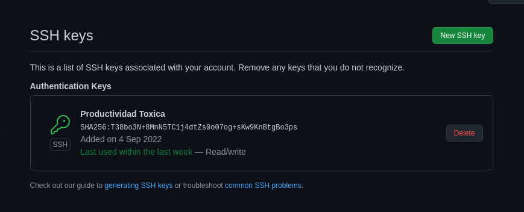

# Configuración de Git
 
Para empezar a trabajar en el repositorio hemos hecho un intercambio de claves ssh entre local y Github para que no se nos pidan credenciales en las futuras acciones que hagamos. Este intercambio se realizo previo al desarrollo de la asignatura

